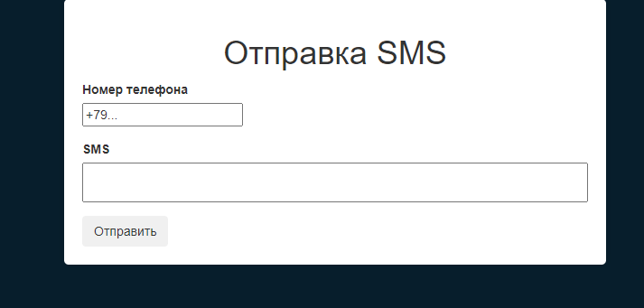
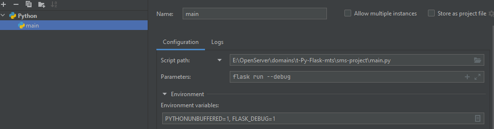

# Review
Проект на:
- *Webpack*;
- *TypeScript*;
- *Flask*.

*Проект имеет [front](https://github.com/Tryd0g0lik/mts_sms_front.git).*\
*Fornt настроен через `webpack`. Сама работа проходила через сборщик `yarn`.*\



## Tree of project
Для дальнейшей работы с front и back в корне создайте `sms_front` и \
`sms-project`. Директории являются sub-root в основном проекта \
для работы с front и back.    

Из `webpack` сборка проходит:

|||
|:---|:---|
|`sms_postman/static/styles/style.css`|`sms_postman/templates/index.html`|
|`sms_postman/static/scripts/main-792-51352717b8978e745511.js`|`sms_postman/static/scripts/manifest.json`|
|||

Файл *.js , при каждой сборке имеет разные имена. \
Например `main-792-51352717b8978e745511.js`. Сделано для отслеживания версий. \
В шаблон вставляется через дополнительный код `receive_pathname_js_file()`.

## About project
*Запуская проект открывается страница браузера.* \
*На главной странице форма отправки сообщенийю*\
*Рабочатает только с больными номерами и только с номерами из РФ.*\
*Min. Количество символов в номере - 10 символов.* \
*Min. Количество символов в сообщении 3 символа. Max. 35, Хотя сам МТС \
допускает больше. К запрещённым символам относится* " *?!'^+%&/()=}][{$#@!~`".

*В случае ошибки и/или успешной отправки получаем сообщение под заголовком\
страницы "Отправка SMS"*.

## .ENV
```text
PROJECT_SECRET_KEY=< secret_key_of_your_app >
API_KEY=< secret_key_of_your_account_from_mts >
PHONE_SEND=< mobil_number_from_app >
API_URL=https://api.exolve.ru/messaging/v1/SendSMS
```

## Commands
### For run the app
`flask run --debug` в строке `Parameters` для PyCharm. \ 
 \
`Ctrl+F9` для старта.

## And last
Проект имеет настроенный front. В начале логику формы хотел пустить через JS. 
Но после сделал через формы от flask.

